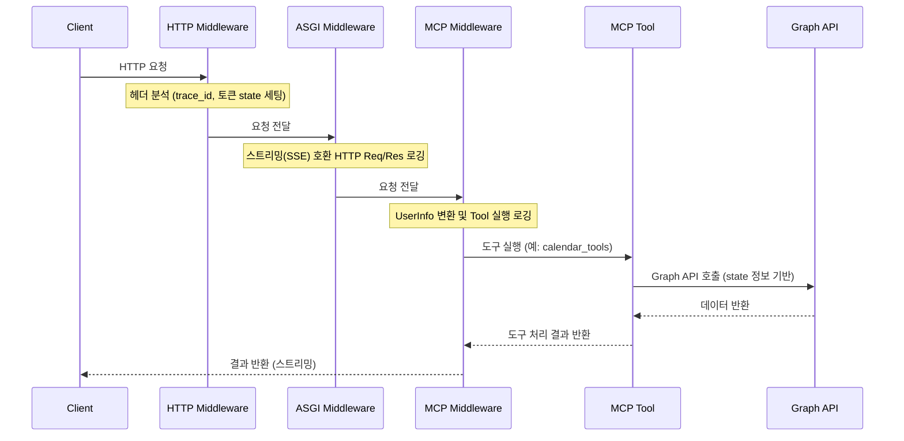
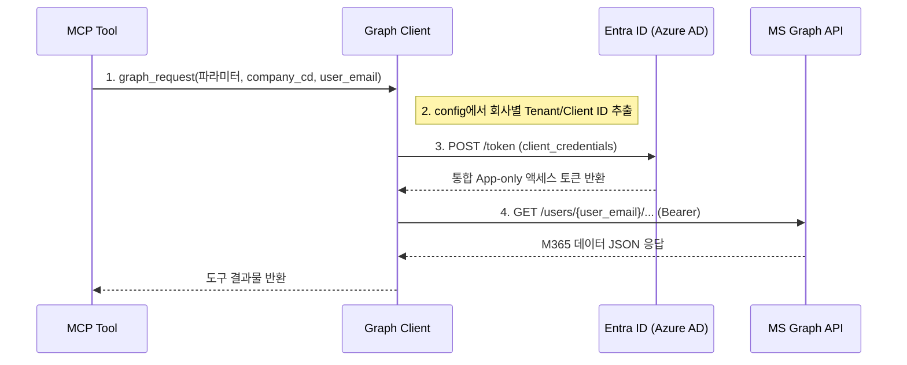
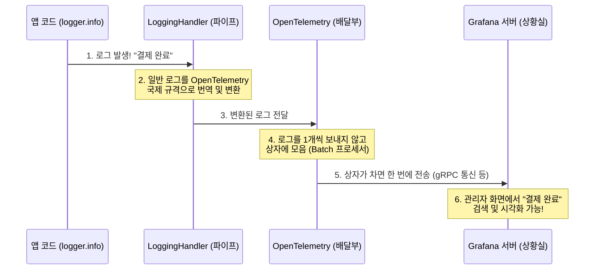

# MCP Sample (FastMCP)

Microsoft 365 데이터(일정, 메일 등) 조회를 중심으로 구성한 FastMCP 서버 샘플입니다.  
현재 버전은 HTTP 요청 헤더에서 사용자 토큰을 읽고, MCP tool 실행까지 같은 요청 상태(state) 컨텍스트로 연결하는 흐름을 포함합니다.

## 현재 핵심 기능
- `/mcp` 경로로 Streamable HTTP 기반 MCP 서버 제공
- HTTP 미들웨어에서 `x-request-id`와 `mcp_user_token` 처리
- JWT 토큰으로 사용자 정보(`UserInfo`)를 해석해 `request.state`에 저장하기 위해 지연(Lazy) 파싱 적용
- MCP tool 미들웨어에서 `trace_id` 기준 실행 로그 기록 (`[http_request]` / `[mcp_tool_call]` / `[GraphAPI Request]` 3계층)
- `calendar_tools`, `mail_tools` 등을 통해 M365 API 통합 제공
- 모든 Tool 함수는 **파라미터 → JWT 토큰 → 환경변수 Default** 3단계 우선순위로 이메일/회사코드를 결정

## 요청 처리 아키텍처
HTTP 요청을 3단계의 미들웨어를 거쳐 처리함으로써, 스트리밍 응답 로깅과 컨텍스트 관리를 명확하게 분리합니다.



1. **HttpMiddleware** (`http_middleware.py`): HTTP 요청 헤더에서 `x-request-id`를 `trace_id`로 추출하고 `mcp_user_token`을 읽어 `request.state`에 저장합니다. 헤더에 `x-request-id`가 없으면 `uuid4()`로 자동 생성하여 응답 헤더에도 반환합니다. (최외곽 미들웨어)
2. **HttpLoggingASGIMiddleware** (`http_asgi_middleware.py`): FastMCP의 SSE(Server-Sent Events) 스트리밍 환경에서 HTTP 요청/응답 전체를 안전하게 로깅합니다. SSE 특성상 request body를 **선독(Pre-read)** 한 뒤 `replay_receive()`로 앱에 재생하고, response body의 마지막 청크(`more_body=False`) 시점에 응답 로그를 기록합니다. `tools/call`, `tools/list` MCP 메서드만 로깅 대상으로 필터링합니다.
3. **MCPLoggingMiddleware** (`mcp_midleware.py`): MCP 도구가 실행될 때 개입하여, `request.state`의 `user_token`을 `UserInfo`로 검증·변환합니다(Lazy 파싱 — 첫 Tool 실행 시 1회만 수행 후 `state`에 캐시). 도구 실행 성공 시 `logger.info()`, 실패 시 `logger.exception()`으로 로깅하며 예외는 반드시 `raise`로 재발생시킵니다.

### 🔍 trace_id 전파 경로

하나의 HTTP 요청에 대해 모든 계층 로그에 동일한 `trace_id`가 삽입되어, 단일 요청의 전체 흐름을 추적할 수 있습니다.

```
HTTP 헤더 x-request-id (없으면 uuid4 자동 생성)
  │
  ├─ [http_request]    로그 (HttpLoggingASGIMiddleware)
  ├─ [mcp_tool_call]   로그 (MCPLoggingMiddleware)
  └─ [GraphAPI Request] 로그 (graph_client.py)
        ↓
  응답 헤더 x-request-id 로 클라이언트에 반환
```

### 📊 3계층 로깅 요약

| 계층 | 파일 | 로그 태그 | 로깅 시점 | 레벨 |
| :-- | :-- | :-- | :-- | :--: |
| HTTP 요청/응답 | `http_asgi_middleware.py` | `[http_request]` / `[http_response]` | tools/call, tools/list 요청만 | INFO |
| MCP Tool 실행 | `mcp_midleware.py` | `[mcp_tool_call]` | Tool 함수 실행 전후, 에러 시 | INFO / EXCEPTION |
| Graph API 호출 | `graph_client.py` | `[GraphAPI Request]` | MS Graph API 호출 직후 finally 블록 | INFO / ERROR |

### 🔐 토큰 발급 및 Graph API 호출 로직
해당 미들웨어를 거쳐 요청된 도구 연산은 아래와 같은 흐름으로 MS Graph API에 접근합니다.



1. 도구(Tool) 호출 시 파라미터 또는 JWT(`current_user`)에서 `company_cd`와 `user_email` 정보를 추출합니다.
2. `graph_client.py`의 `graph_request()`가 트리거되며, 설정(`config`) 파일 내 저장된 각 회사별 정보(`tenant_id`, `client_id`, `client_secret`)를 가져옵니다.
3. **Microsoft Entra ID (Azure AD)** `/token` 엔드포인트에 `client_credentials`(Client Credentials Grant) 방식으로 서버 투 서버 인증을 거친 뒤, **통합 App-only 액세스 토큰**을 발급받습니다.
4. 이 토큰을 Bearer 헤더에 담아 `https://graph.microsoft.com/v1.0/users/{user_email}/...` 경로로 원하는 MS 365 데이터를 획득(조회)합니다.

## Tools 공통 구현 패턴

`/tools` 폴더의 모든 Tool 함수는 아래 3단계 우선순위 구조를 공통으로 따릅니다.

```python
# ① HTTP request.state에서 현재 사용자 정보 읽기
current_user = _get_request_current_user()  # get_http_request() → .state.current_user

# ② 이메일/회사코드 결정 (3단계 우선순위)
if user_email is not None:          # 1순위: 호출 시 직접 전달된 파라미터
    query_email = user_email
    query_company_cd = DEFAULT_COMPANY_CD
elif current_user is not None:      # 2순위: JWT 토큰으로 파싱된 사용자 정보
    query_email = current_user.email
    query_company_cd = current_user.company_cd
else:                               # 3순위: .env 파일의 DEFAULT 값
    query_email = DEFAULT_USER_EMAIL
    query_company_cd = DEFAULT_COMPANY_CD

# ③ Graph API 호출
result = await graph_request(method="GET", path=path, user_email=query_email, ...)
```

> **왜 이렇게 설계했나?**  
> LLM 에이전트는 대화 맥락에서 대상자 이메일을 파라미터로 전달할 수 있고, 인증된 사용자는 JWT에서 자동으로 추출되며, 개발/테스트 환경에서는 Default 값 하나로 동작합니다.  
> 이 3단계 패턴 덕분에 인증 없이도 테스트가 가능하고, 프로덕션에서는 JWT 기반 보안이 자연스럽게 적용됩니다.

---

## 프로젝트 구조
실제 코드 구조는 다음과 같이 책임 단위로 분리되어 있습니다.

```text
app/
  main.py                     # FastMCP 서버 조립 및 HTTP 앱 생성 (실제 서버 진입점)
  server.py                   # (테스트용) 단일 파일 기반 FastMCP 기본 샘플

  core/
    config.py                 # 환경변수(.env) 및 회사별 MS365 설정
    http_asgi_middleware.py   # ASGI 수준의 미들웨어 구현체 [http_request]/[http_response] 로그
    http_middleware.py        # HTTP 식별(trace_id) 및 토큰 파싱 로직
    logger_config.py          # 로깅 설정
    mcp_context.py            # (레거시) ContextVar를 활용했던 이전 컨텍스트 파일
    mcp_midleware.py          # MCP tool 호출 로그 미들웨어 [mcp_tool_call] 로그

  clients/
    graph_client.py           # Microsoft Graph API 호출 및 [GraphAPI Request] 로그
    http_client.py            # 공통 Async HTTP 클라이언트 설정

  common/
    logger.py                 # 공용 로거 제공 (OpenTelemetry → Grafana 파이프라인)

  models/
    user_info.py              # 토큰 해석 데이터(UserInfo) 모델링 구성

  security/
    jwt_auth.py               # JWT 검증 및 사용자 인가 모듈
    key_cache.py              # 서명 검증을 위한 공개키 캐싱 장치

  tools/
    calendar_tools.py         # 일정 관리(조회/생성/수정/삭제) MCP 도구
    mail_tools.py             # 메일 관련 다양한 조회 기능 (최신, 미읽음, 플래그 등)
    sharepoint_tools.py       # SharePoint / OneDrive 파일 조회 및 검색 도구
    teams_tools.py            # Teams 채팅 목록 조회 및 메시지 전송 도구
    to_do_tools.py            # Microsoft To-Do 할 일 내역 관리 도구
```

## 선언된 도구(Tools) 목록
소스 코드 내에 구현 및 선언되어 있는 주요 기능들입니다.
*(현재 `main.py`에 등록되어 운영 중인 도구는 캘린더, 메일, 팀즈, 쉐어포인트 도구들입니다.)*

### 1) 캘린더 도구 (`calendar_tools.py`)
| 도구명 | 상태 | 설명 | 연동 API |
| :-- | :--: | :-- | :-- |
| `list_calendar_events` | ✅활성화 | 시작/종료일을 입력받아 내 캘린더 일정을 조회합니다. | `/calendarView` |
| `get_calendar_event` | ✅활성화 | 단일 캘린더 일정의 상세 정보를 조회합니다. | `/events/{id}` |
| `create_calendar_event` | ✅활성화 | 캘린더에 새로운 일정을 생성합니다. | `POST /events` |
| `update_calendar_event` | ✅활성화 | 기존 캘린더 일정 내용(시간, 장소 등)을 부분 수정합니다. | `PATCH /events/{id}` |
| `delete_calendar_event` | ✅활성화 | 기존 캘린더 일정을 삭제합니다. | `DELETE /events/{id}` |
| `check_company_token` | ⚠️미구현 | 추후 JWT 토큰이나 회사 연동 검증을 위해 설계됨 (`NotImplementedError`) | - |

### 2) 메일 도구 (`mail_tools.py`)
| 도구명 | 상태 | 설명 | 연동 API |
| :-- | :--: | :-- | :-- |
| `get_recent_emails` | ✅활성화 | 최근 수신된 이메일 목록 대략 조회 | `/mailFolders/inbox/messages` |
| `get_unread_emails` | ✅활성화 | 읽지 않은(`isRead=false`) 메일 조회 | `/mailFolders/inbox/messages` |
| `get_important_or_flagged_emails` | ✅활성화 | 중요함(`high`) 또는 깃발(`flagged`) 표시된 메일 조회 | `/mailFolders/inbox/messages` |
| `search_emails_by_keyword_advanced` | ✅활성화 | 이메일 제목 또는 본문에서 특정 키워드 풀텍스트 검색 | `/messages` |
| `search_emails_by_sender_advanced` | ✅활성화 | 발신자 메일/이름 기준으로 필터링 검색 | `/messages` |
| `search_emails_by_attachment` | ✅활성화 | 첨부파일 존재 여부 및 파일명/확장자별 필터 탐색 | `/messages` |
| `get_sent_emails` | ✅활성화 | 본인이 발송한 보낸 편지함(`sentitems`) 목록 검색 | `/mailFolders/sentitems/messages` |
| `get_email_detail_view` | ✅활성화 | 단일 메일의 상세 본문 텍스트 및 첨부파일 목록 조회 | `/messages/{id}` |

### 3) Teams 도구 (`teams_tools.py`)
| 도구명 | 상태 | 설명 | 연동 API |
| :-- | :--: | :-- | :-- |
| `list_my_chats` | ✅활성화 | 사용자가 참여 중인 최근 채팅방 목록을 조회합니다. | `/chats` |
| `get_chat_messages` | ✅활성화 | 특정 채팅방(`chat_id`)의 최근 메시지 내역을 조회합니다. | `/chats/{id}/messages` |
| `send_chat_message` | ✅활성화 | 특정 채팅방에 텍스트 또는 HTML 메시지를 전송합니다. | `POST /chats/{id}/messages` |

### 4) SharePoint / OneDrive 도구 (`sharepoint_tools.py`)
| 도구명 | 상태 | 설명 | 연동 API |
| :-- | :--: | :-- | :-- |
| `list_drive_files` | ✅활성화 | 내 드라이브(루트 또는 특정 폴더)의 파일/폴더 목록을 조회합니다. | `/drive/.../children` |
| `search_drive_files` | ✅활성화 | 내 드라이브 전체에서 파일명 등 키워드를 기반으로 검색합니다. | `/drive/root/search` |
| `get_drive_file_info` | ✅활성화 | 파일의 상세 정보 및 다운로드 링크를 조회합니다. | `/drive/items/{id}` |

### 5) To-Do 도구 (`to_do_tools.py`)
| 도구명 | 상태 | 설명 | 연동 API |
| :-- | :--: | :-- | :-- |
| `todo_list_task_lists` | ✅활성화 | 할 일 목록(Category)의 리스트를 조회합니다. | `/todo/lists` |
| `todo_list_tasks` | ✅활성화 | 특정 할 일 목록 내의 할 일(Task) 건들을 조회합니다. | `/todo/lists/{id}/tasks` |
| `todo_create_task` | ✅활성화 | 새로운 할 일(Task)을 생성합니다. | `POST /todo/lists/{id}/tasks` |
| `todo_update_task` | ✅활성화 | 기존 할 일의 상태나 내용을 수정합니다. | `PATCH /todo/lists/{id}/tasks/{id}` |
| `todo_delete_task` | ✅활성화 | 기존 할 일을 삭제합니다. | `DELETE /todo/lists/{id}/tasks/{id}` |

## 실행 및 검증 방법
### 로컬 개발
```powershell
.\.venv\Scripts\pip.exe install -r requirements.txt
.\.venv\Scripts\uvicorn.exe app.main:app --host 0.0.0.0 --port 8002
```

### MCP Inspector 테스트
터미널을 열고 다음 명령어로 인스펙터(Inspector)를 띄워 구동 상태를 확인할 수 있습니다.
```bash
npx @modelcontextprotocol/inspector
```

- **Transport Type:** `streamable-http`
- **URL:** `http://127.0.0.1:8002/mcp`
- 연결 후, 서버 측에 등록된 각 도구(예: `calendar_tools`, `mail_tools` 관련)들을 테스트할 수 있습니다. 성공적으로 연결되면 도구 설정과 로그가 나옵니다.

## 환경 변수 예시
```env
LOG_LEVEL=DEBUG
AUTH_JWT_USER_TOKEN=false
MS365_CONFIGS={"leodev901":{"tenant_id":"...","client_id":"...","client_secret":"..."}}
```

### 주요 환경 변수
- `LOG_LEVEL`: 로그 레벨
- `AUTH_JWT_USER_TOKEN`: `true`면 실제 JWT 검증 경로 적용, `false`면 샘플용 사용자 정보 매핑 사용
- `MS365_CONFIGS`: 회사별 식별 정보(Microsoft 365 테넌트 세부 설정) JSON 데이터

## 한 줄 요약
이 프로젝트는 "HTTP 요청 헤더에서 JWT를 분석해 확보한 안전한 정보를 바탕으로(`request.state` 활용), 사용자 맞춤형 MS 365 데이터(일정, 메일 등)를 제공하는 FastMCP 서버 구현체"입니다.

---

## 📊 초보자를 위한 OpenTelemetry 및 Grafana 로깅 아키텍처

앱에서 `logger.info()`나 `logger.error()`를 호출할 때, 이 통나무(로그)들이 어떻게 한곳에 모여 예쁜 대시보드로 보여지는지에 대한 설명입니다.

### 💡 핵심 개념 (비유)
1. **OpenTelemetry (표준 배달부)**: 수많은 앱, 서버, DB에서 발생하는 다양한 로그 정보를 '똑같은 규격'으로 포장해서 배달해주는 국제 규격 도구입니다.
2. **Grafana (중앙 상황실)**: 배달부가 모아온 수많은 로그들을 모아두고, 사용자가 보기 좋게 검색하거나 매력적인 그래프로 띄워주는 모니터링 대스보드입니다.

### 🔄 로깅 시각화 흐름도



### 📝 코드(`app/common/logger.py`)에 담긴 4가지 핵심 설정
1. **신분증 만들기 (Resource)**: 로그가 도대체 '어느 서버'의 '어느 프로그램'에서 났는지 꼬리표를 붙입니다. (예: `service.name = mcp-ms365`)
2. **배달 목적지 설정 (Exporter)**: 택배를 보낼 도착 주소를 적습니다. 여기서는 `GRAFANA_ENDPOINT`가 목적지입니다.
3. **모아서 보내기 (Batch Processor)**: 로그가 터질 때마다 매번 택배를 보내면 통신비(서버 부하)가 크기 때문에, 큰 상자에 모았다가 일정 갯수가 차면 트럭을 출발시킵니다.
4. **다리 놓기 (Logging Handler)**: 개발자가 평소 쓰던 파이썬 `logger`와 오픈텔레메트리 배달원 사이를 연결해주는 다리(Handler)를 연결해서, 코드 수정 없이도 기존의 로깅 코드가 자연스럽게 그라파나로 전달되도록 만듭니다.

---

### 📦 주요 OpenTelemetry Exporter (모니터링 목적지) 비교
OpenTelemetry는 특정 플랫폼에 종속되지 않으므로, 도착 주소(Exporter) 설정만 바꾸면 다양한 모니터링 시스템으로 로그를 바로 전송할 수 있습니다. 

| Exporter (플랫폼) | 비용 | 장점 | 단점 | 특징 / 적합한 환경 |
| :-- | :--: | :-- | :-- | :-- |
| **Grafana (Loki/Tempo)** | 무료/유료 | 시각화 대시보드가 매우 강력하며, 오픈소스 생태계가 넓음 | 초기 설정과 서버 관리가 약간 복잡할 수 있음 | 가장 대중적인 오픈소스 로깅/메트릭 대시보드 |
| **Datadog (데이터독)** | 유료 | 연동이 매우 쉽고 막강한 AI/기계학습 기반 분석 기능 제공 | 비용이 상당히 비쌈 (로그 볼륨에 따라 요금 폭탄 주의) | 대형 기업 및 빠른 구축이 필요한 실무 환경 |
| **Dynatrace** | 유료 | 인프라 구조를 자동 파악해 모니터링하는 AI 분석(Davis) 탁월 | 초기 도입 비용이 높고 설정 러닝커브가 존재함 | 복잡한 MSA(마이크로서비스)를 운영하는 대기업 |
| **Jaeger (예거)** | 무료 | 특히 "추적(Trace)" 기능에 특화되어 분산 시스템 분석에 유리 | 로그 메세지 자체보다는 '흐름 분석'에 특화되어 있음 | 서비스 간 호출(API 통신)의 병목을 찾을 때 최적 |
| **Prometheus** | 무료 | 빠르고 안정적인 시계열 데이터(평균, 카운트 등) 수집 | 상세한 '텍스트 로그' 보존에는 적합하지 않음 | 서버의 CPU, 메모리 상태(메트릭) 측정 중심 |
| **ELK Stack** (Elastic) | 무료/유료 | 강력한 텍스트 전문 검색과 대규모 로그 데이터 관리 가능 | 무거우며 운영 시 메모리와 리소스 소모가 큰 편임 | 복잡한 로그 내용을 자세하게 검색하고 분석할 때 |

*(이 프로젝트에서는 무료/오픈소스로 강력한 시각화를 제공하는 **Grafana**를 기본 목적지로 사용하도록 작성되어 있습니다.)*

---