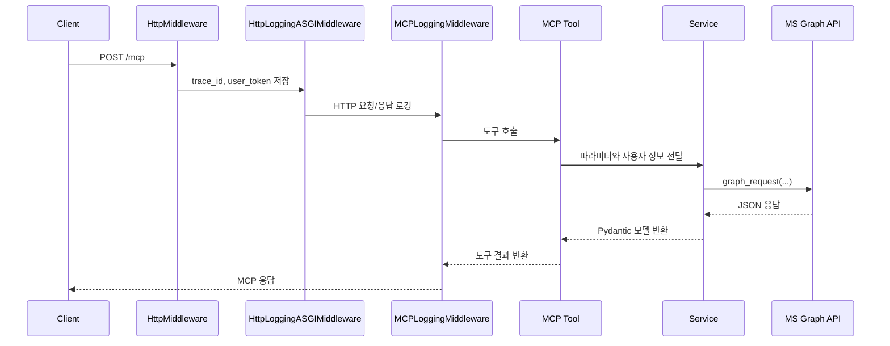

# MCP Sample (FastMCP)

Microsoft 365 데이터를 MCP 도구로 제공하는 FastMCP 서버 예제입니다.  
현재 구현은 MS Graph API를 사용해 Outlook Calendar, Mail, Teams, OneDrive/SharePoint, Microsoft To Do 데이터를 조회하거나 일부 생성/수정/삭제합니다.

## 현재 통합 기능

- `/mcp` 경로에서 Streamable HTTP 기반 MCP 서버 제공
- HTTP 요청 헤더의 `x-request-id`, `mcp_user_token` 처리
- MCP 도구 실행 로그, HTTP 로그, Graph API 호출 로그 기록
- MS Graph App-only 토큰 기반 API 호출
- `calendar_list` 기준의 `Tool -> Service -> Schema` 패턴 적용
- 모든 도구에서 `user_email -> current_user -> DEFAULT_*` 순서로 조회 대상 사용자 결정

## 요청 처리 흐름


```mermaid
sequenceDiagram
    participant Client
    participant HTTP as HttpMiddleware
    participant ASGI as HttpLoggingASGIMiddleware
    participant MCP as MCPLoggingMiddleware
    participant Tool as MCP Tool
    participant Service as Service
    participant Graph as MS Graph API

    Client->>HTTP: POST /mcp
    HTTP->>ASGI: trace_id, user_token 저장
    ASGI->>MCP: HTTP 요청/응답 로깅
    MCP->>Tool: 도구 호출
    Tool->>Service: 파라미터와 사용자 정보 전달
    Service->>Graph: graph_request(...)
    Graph-->>Service: JSON 응답
    Service-->>Tool: Pydantic 모델 반환
    Tool-->>MCP: 도구 결과 반환
    MCP-->>Client: MCP 응답
```

`Tool`은 MCP에 노출되는 함수입니다.  
`Service`는 Graph API 경로와 요청 본문을 구성합니다.  
`Schema`는 반환값을 Pydantic 모델로 검증합니다.  
Pydantic: Python 데이터 검증 라이브러리입니다.

## 프로젝트 구조

```text
app/
  main.py                     # FastMCP 앱 생성 및 도구 등록

  clients/
    graph_client.py           # MS Graph API 공통 호출
    http_client.py            # 공통 HTTP 클라이언트
    mcp_client.py             # MCP 도구 로그 저장 클라이언트

  common/
    graph_error_wrapper.py    # Graph 예외를 MCP 응답으로 변환
    logger.py                 # Loguru/OpenTelemetry 로거 초기화

  core/
    config.py                 # 환경변수 및 MS365 설정
    http_middleware.py        # trace_id, user_token 저장
    http_asgi_middleware.py   # HTTP 요청/응답 로깅
    mcp_midleware.py          # MCP 도구 실행 로깅

  models/
    logging.py                # MCP 도구 로그 모델
    user_info.py              # 인증 사용자 정보 모델

  schemas/
    calendar.py               # Calendar 반환 스키마
    mail.py                   # Mail 반환 스키마
    sharepoint.py             # Drive 반환 스키마
    teams.py                  # Teams 반환 스키마
    todo.py                   # To Do 반환 스키마

  services/
    calendar_service.py       # Calendar Graph API 로직
    mail_service.py           # Mail Graph API 로직
    sharepoint_service.py     # OneDrive/SharePoint Graph API 로직
    teams_service.py          # Teams Graph API 로직
    todo_service.py           # To Do Graph API 로직

  tools/
    calendar_tools.py         # Calendar MCP 도구
    mail_tools.py             # Mail MCP 도구
    sharepoint_tools.py       # Drive MCP 도구
    teams_tools.py            # Teams MCP 도구
    to_do_tools.py            # To Do MCP 도구
    tool_context.py           # 현재 사용자 해석 공통 유틸
```

## 공통 사용자 결정 규칙

모든 도구는 Graph API 호출 대상을 아래 순서로 결정합니다.

```python
current_user = get_request_current_user()
query_email, query_company_cd = resolve_graph_user(user_email, current_user)
```

우선순위:

1. 도구 파라미터의 `user_email`
2. HTTP 요청의 JWT에서 파싱된 `current_user`
3. `.env`의 `DEFAULT_USER_EMAIL`, `DEFAULT_COMPANY_CD`

왜 이렇게 했는지: MCP 도구를 LLM이 직접 호출할 때는 `user_email`을 명시할 수 있고, 실제 서비스 요청에서는 JWT 사용자 정보를 자동으로 사용할 수 있습니다. 로컬 테스트에서는 기본값을 사용해 빠르게 검증할 수 있습니다.

## 도구 목록

### Calendar

| 도구명 | 설명 | Graph API |
| :-- | :-- | :-- |
| `calendar_list` | 기간 기준 캘린더 일정 목록 조회 | `GET /calendarView` |
| `calendar_detail` | 단일 일정 상세 조회 | `GET /events/{id}` |
| `calendar_create` | 새 일정 생성 | `POST /events` |
| `calendar_update` | 기존 일정 부분 수정 | `PATCH /events/{id}` |
| `calendar_delete` | 기존 일정 삭제 | `DELETE /events/{id}` |
| `search_email_by_name` | M365 사용자 이름으로 이메일 검색 | `GET /users` |

### Mail

| 도구명 | 설명 | Graph API |
| :-- | :-- | :-- |
| `mail_recent_list` | 받은 편지함 최근 메일 조회 | `GET /mailFolders/inbox/messages` |
| `mail_unread_list` | 읽지 않은 메일 조회 | `GET /mailFolders/inbox/messages` |
| `mail_important_or_flagged_list` | 중요 또는 플래그 메일 조회 | `GET /mailFolders/inbox/messages` |
| `mail_search_by_keyword` | 제목/본문 키워드 검색 | `GET /messages?$search=...` |
| `mail_search_by_sender` | 발신자 이름/메일 기준 검색 | `GET /messages?$filter=...` |
| `mail_search_by_attachment` | 첨부파일이 있는 메일 검색 | `GET /messages?$filter=hasAttachments eq true` |
| `mail_sent_list` | 보낸 편지함 최근 메일 조회 | `GET /mailFolders/sentitems/messages` |
| `mail_detail` | 단일 메일 상세와 첨부파일 조회 | `GET /messages/{id}`, `GET /messages/{id}/attachments` |

### Teams

| 도구명 | 설명 | Graph API |
| :-- | :-- | :-- |
| `teams_list_chats` | 참여 중인 Teams 채팅방 목록 조회 | `GET /chats` |
| `teams_list_chat_messages` | 특정 채팅방의 최근 메시지 조회 | `GET /chats/{id}/messages` |
| `teams_send_chat_message` | Teams 채팅방에 메시지 전송 | `POST /chats/{id}/messages` |

### OneDrive / SharePoint

| 도구명 | 설명 | Graph API |
| :-- | :-- | :-- |
| `drive_list_files` | 루트 또는 특정 폴더의 파일/폴더 목록 조회 | `GET /drive/root/children`, `GET /drive/items/{id}/children` |
| `drive_search_files` | 드라이브 파일 검색 | `GET /drive/root/search(q='...')` |
| `drive_get_file_info` | 파일/폴더 상세와 다운로드 URL 조회 | `GET /drive/items/{id}` |

### Microsoft To Do

| 도구명 | 설명 | Graph API |
| :-- | :-- | :-- |
| `todo_list_task_lists` | 할 일 목록 조회 | `GET /todo/lists` |
| `todo_list_tasks` | 특정 목록의 할 일 조회 | `GET /todo/lists/{id}/tasks` |
| `todo_create_task` | 새 할 일 생성 | `POST /todo/lists/{id}/tasks` |
| `todo_update_task` | 기존 할 일 부분 수정 | `PATCH /todo/lists/{id}/tasks/{id}` |
| `todo_delete_task` | 기존 할 일 삭제 | `DELETE /todo/lists/{id}/tasks/{id}` |

## 실행 방법

전제조건:

- Python 3.10 이상
- `.venv` 가상환경
- `.env`에 MS365 설정

```powershell
.\.venv\Scripts\pip.exe install -r requirements.txt
.\.venv\Scripts\uvicorn.exe app.main:app --host 0.0.0.0 --port 8002
```

MCP Inspector로 확인:

```bash
npx @modelcontextprotocol/inspector
```

- Transport Type: `streamable-http`
- URL: `http://127.0.0.1:8002/mcp`

## 환경 변수 예시

```env
LOG_LEVEL=DEBUG
ENV=local
AUTH_JWT_USER_TOKEN=false
DEFAULT_USER_EMAIL=admin@leodev901.onmicrosoft.com
DEFAULT_COMPANY_CD=leodev901
MS365_CONFIGS={"leodev901":{"tenant_id":"...","client_id":"...","client_secret":"...","default_user_email":"admin@leodev901.onmicrosoft.com"}}
```

## 검증 명령

```powershell
.\.venv\Scripts\python -m compileall app
.\.venv\Scripts\python -c "import app.main; print('main import ok')"
```

기대 결과:

- 모든 Python 파일이 문법 오류 없이 컴파일됩니다.
- `main import ok`가 출력됩니다.

## 참고 문서

- [TOOLS_SERVICE_GUIDE.md](docs/TOOLS_SERVICE_GUIDE.md): 도구/서비스/스키마 패턴 설명
- [CALENDAR_GUIDE.md](docs/CALENDAR_GUIDE.md): 캘린더 도구 상세 설명
- [GRAPH_LOGGING_GUIDE.md](GRAPH_LOGGING_GUIDE.md): Graph API 로깅 설명
