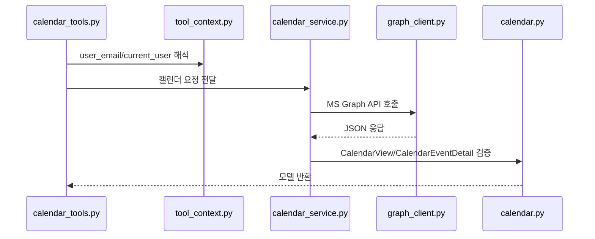

# Calendar Guide

## 문제 정의

캘린더 도구는 MS Graph Calendar API를 MCP 도구로 감싼 기능입니다.  
기준 도구는 `calendar_list`이며, 같은 패턴으로 상세 조회, 생성, 수정, 삭제 도구를 제공합니다.

## 접근 방법



`calendar_tools.py`는 MCP 파라미터와 LLM 가이드를 담당합니다.  
`calendar_service.py`는 `/calendarView`, `/events` 경로와 payload를 담당합니다.  
`calendar.py`는 Graph 응답의 `start`, `end`, `location`, `attendees` 같은 중첩 객체를 모델로 검증합니다.

## 도구 목록

| 도구명 | 설명 | 반환 |
| :-- | :-- | :-- |
| `calendar_list` | 기간 기준 일정 목록 조회 | `list[CalendarView]` |
| `calendar_detail` | 단일 일정 상세 조회 | `CalendarEventDetail` |
| `calendar_create` | 새 일정 생성 | `CalendarEventDetail` |
| `calendar_update` | 기존 일정 부분 수정 | `CalendarEventDetail` |
| `calendar_delete` | 기존 일정 삭제 | `dict` |
| `search_email_by_name` | 사용자 이름으로 이메일 검색 | `list[dict]` |

## 코드

`calendar_list`의 핵심 흐름입니다.

```python
current_user = get_request_current_user()
query_email, query_company_cd = resolve_graph_user(user_email, current_user)

return await calendar_service.list_calendar_view(
    start_date=start_date,
    end_date=end_date,
    top=top,
    user_email=query_email,
    company_cd=query_company_cd,
)
```

서비스 계층은 Graph 응답의 `value` 배열만 꺼내 스키마로 검증합니다.

```python
result = await graph_request(
    method="GET",
    path=path,
    user_email=user_email,
    company_cd=company_cd,
)

return TypeAdapter(list[CalendarView]).validate_python(result.get("value", []))
```

## 검증

전제조건:

- `.venv` 가상환경이 있어야 합니다.
- `pydantic>=2.10.0`이 설치되어 있어야 합니다.

```powershell
.\.venv\Scripts\python -m compileall app\tools\calendar_tools.py app\services\calendar_service.py app\schemas\calendar.py
```

샘플 스키마 검증:

```powershell
.\.venv\Scripts\python -c "from pydantic import TypeAdapter; from app.schemas.calendar import CalendarView; data=[{'id':'1','subject':'회의','start':{'dateTime':'2026-05-13T10:00:00','timeZone':'Asia/Seoul'},'end':{'dateTime':'2026-05-13T11:00:00','timeZone':'Asia/Seoul'},'location':{'displayName':'회의실'},'attendees':[]}]; print(TypeAdapter(list[CalendarView]).validate_python(data))"
```

기대 결과:

- `CalendarView(...)` 객체 목록이 출력됩니다.

## 실패 예시와 해결

실패 예시: `start`와 `end`를 문자열로만 정의하면 Graph 응답의 `{"dateTime": "...", "timeZone": "..."}` 객체를 검증하지 못합니다.

해결 방법: `DateTimeTimeZone` 모델로 `start`, `end` 필드를 받습니다.

## 한 줄 요약

캘린더 도구는 `calendar_list` 기준으로 사용자 해석, 서비스 호출, Pydantic 반환 검증을 분리해서 동작합니다.
