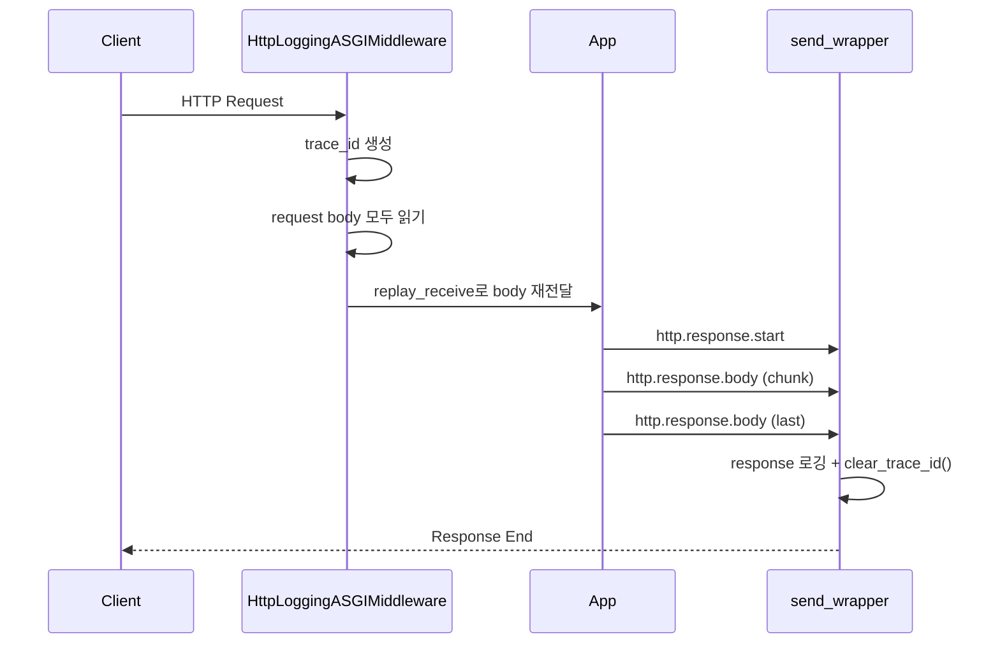

# HTTP_MIDDLEWARE_ASGI_GUIDE.md

## 문제 정의

`BaseHTTPMiddleware`는 스트리밍 응답에서 `finally`가 너무 빨리 끝날 수 있다.  
그래서 `trace_id`를 요청 시작부터 SSE 종료까지 유지하려면 더 기본적인 ASGI 미들웨어가 필요하다.

이번 문서는 "함수 분리 최소화"를 기준으로 설명한다.  
즉, 초급 개발자가 파일 하나를 위에서 아래로 읽으며 흐름을 이해하는 데 집중한다.

코드 경로:
- `app/core/http_middware_ASGI.py`
- `app/core/mcp_context.py`

## 접근 방법

이번 버전은 일부러 단순하게 만들었다.

- 보조 함수 분리를 하지 않는다.
- `__call__()` 안에서 요청 읽기, trace_id 생성, 응답 가로채기, cleanup까지 한 번에 보여준다.
- request/response 로깅은 바로 완성하지 않고 `TO-DO logging` 위치만 잡아둔다.

현재는 예외적으로 아래 2개만 헬퍼로 분리했다.
- 이유: while 루프가 길어져서 초급자가 본문 흐름을 읽기 어려워졌기 때문이다.
- 나머지 로직은 일부러 그대로 두어 "전체 흐름"이 보이게 유지했다.
- `_read_request_messages()`: request body 읽기
- `_build_body_for_log()`: body bytes를 `dict | str | None`으로 변환

왜 이렇게 했는가:
- 초급 개발자에게는 "흐름을 한 번에 보는 것"이 먼저다.
- 그 다음 단계에서 함수 분리, 공통화, 최적화를 해도 늦지 않다.

## 코드

핵심 클래스:

```python
class HttpLoggingASGIMiddleware:
    async def __call__(self, scope, receive, send):
        trace_id = ...
        set_trace_id(trace_id)

        request_messages = []
        while True:
            message = await receive()
            request_messages.append(message)
            ...

        async def replay_receive():
            ...

        async def send_wrapper(message):
            if message["type"] == "http.response.body" and not message.get("more_body", False):
                clear_trace_id()

            await send(message)

        await self.app(scope, replay_receive, send_wrapper)
```

문법 설명:
- `scope`: 요청 메타 정보
- `receive()`: 요청 body를 읽는 함수
- `send()`: 응답을 보내는 함수
- `await`: 비동기 함수가 끝날 때까지 기다린다는 뜻
- `nonlocal`: 바깥 함수의 지역변수를 안쪽 함수에서 수정할 때 사용
- `message["type"]`:
  - `http.request`: 요청 body 조각
  - `http.response.start`: 응답 시작
  - `http.response.body`: 응답 body 조각
- `more_body=False`: 더 이상 응답 body가 없다는 뜻

자주 쓰는 예시:
- `scope["method"]`: `GET`, `POST`
- `scope["path"]`: 요청 경로
- `json.loads(...)`: JSON 문자열을 dict로 변환
- `uuid.uuid4()`: 고유한 trace_id 생성
- `time.perf_counter()`: 경과 시간 측정

## 플로우



설명:
- 요청이 들어오면 먼저 `trace_id`를 만든다.
- request body를 먼저 읽고 저장한다.
- 앱이 다시 body를 읽을 수 있게 `replay_receive()`로 재전달한다.
- 응답은 `send_wrapper()`가 끝까지 지켜본다.
- 마지막 body 청크에서 cleanup을 실행한다.

## 왜 이렇게 코딩했는가

핵심 이유는 하나다.

- `finally`는 "응답 객체 생성 완료" 시점에 실행될 수 있다.
- 하지만 우리가 원하는 cleanup 시점은 "응답 body 전송 완료" 시점이다.

그래서 응답 이벤트를 직접 가로채는 ASGI 방식이 필요하다.

## 실행 예시

```python
from fastapi import FastAPI
from app.core.http_middware_ASGI import HttpLoggingASGIMiddleware

app = FastAPI()
app.add_middleware(HttpLoggingASGIMiddleware)
```

기대 결과:
- 요청마다 `x-request-id`가 응답 헤더에 추가된다.
- request/response 로깅 위치가 잡힌다.
- 마지막 응답 청크 전까지 `trace_id`가 유지된다.

실패 예시:
- `finally`에서 cleanup을 먼저 수행해서 MCP/SSE 처리 중 `trace_id`가 사라짐

해결 방법:
- 마지막 `http.response.body`에서 cleanup 수행

## 검증

자동 검증:
- `tests/test_http_middleware_asgi.py`

수동 검증 절차:
1. `/mcp/` 같은 스트리밍 엔드포인트에 미들웨어를 붙인다.
2. 응답 generator 내부에서 `get_trace_id()`를 두 번 읽는다.
3. 두 값이 같으면 스트림 중 trace_id 유지가 된 것이다.
4. 마지막 응답 뒤 `http_cleanup` 로그가 찍히는지 확인한다.

성공 기준:
- 응답 중간 trace_id와 종료 직전 trace_id가 동일
- 응답 종료 후 cleanup 로그 출력

## 한 줄 요약

이번 버전은 "함수 분리보다 흐름 이해"를 우선한, 가장 기본적인 ASGI HTTP 미들웨어 학습용 예제다.
