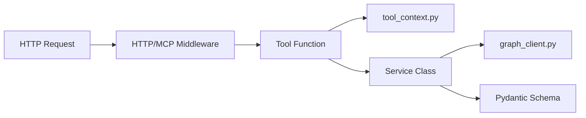

# Tools Service Guide

## 문제 정의

`calendar_list` 도구를 기준으로 모든 MS365 MCP 도구의 구현 구조를 통일했습니다.

기준 구조:

- `app/tools`: MCP에 노출되는 도구 함수와 파라미터 description 작성
- `app/services`: MS Graph API 경로, query string, payload 구성
- `app/schemas`: 반환값 Pydantic 모델 검증
- `app/tools/tool_context.py`: 현재 사용자와 조회 대상 사용자 결정

## 접근 방법



`Tool Function`은 MCP 사용자에게 보이는 인터페이스입니다.  
`Service Class`는 Graph API 세부사항을 감춥니다.  
`Pydantic Schema`는 Graph 응답을 안정적인 반환 형태로 바꿉니다.

왜 이렇게 했는지: 도구 설명과 Graph 호출 로직이 섞이면 함수가 길어지고 테스트가 어려워집니다. 계층을 나누면 도구명과 description은 LLM 친화적으로 유지하면서, Graph API 변경은 서비스 파일에서만 처리할 수 있습니다.

## 코드

새 도구를 추가할 때의 기본 패턴입니다.

```python
@mcp.tool()
@graph_error_wrapper(as_list=True)
async def sample_list(
    top: Annotated[Optional[int], "최대 조회 건수입니다. 기본값은 10입니다."] = 10,
    user_email: Annotated[Optional[str], "조회 대상자의 이메일 주소입니다. 예: user@example.com"] = None,
) -> list[SampleSchema]:
    current_user = get_request_current_user()
    query_email, query_company_cd = resolve_graph_user(user_email, current_user)
    return await sample_service.list_items(top, query_email, query_company_cd)
```

서비스 계층 예시입니다.

```python
class SampleService:
    async def list_items(self, top: int | None, user_email: str, company_cd: str) -> list[SampleSchema]:
        query_top = top if top is not None and top > 0 else 10
        result = await graph_request(
            method="GET",
            path=f"/sample?$top={query_top}",
            user_email=user_email,
            company_cd=company_cd,
        )
        return TypeAdapter(list[SampleSchema]).validate_python(result.get("value", []))
```

## 검증

전제조건:

- `.venv` 가상환경이 있어야 합니다.
- `.env`에 MS365 설정이 있어야 실제 Graph 호출이 가능합니다.

```powershell
.\.venv\Scripts\python -m compileall app
.\.venv\Scripts\python -c "import app.main; print('main import ok')"
```

기대 결과:

- 모든 도구, 서비스, 스키마 파일이 문법 오류 없이 컴파일됩니다.
- `app.main` import가 성공합니다.

## 대안과 트레이드오프

대안: 도구 함수 안에서 바로 `graph_request`를 호출할 수 있습니다.  
트레이드오프: 파일 수는 줄지만 도구 함수가 길어지고, 반환 스키마 검증과 Graph payload 구성이 흩어져 유지보수가 어려워집니다.

## 한 줄 요약

도구는 LLM 인터페이스, 서비스는 Graph API 로직, 스키마는 반환 검증을 담당하도록 분리했습니다.
